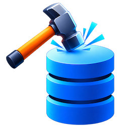
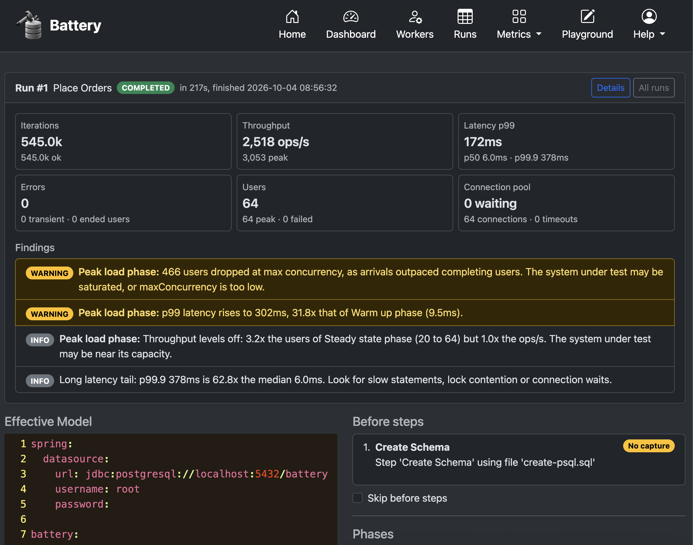
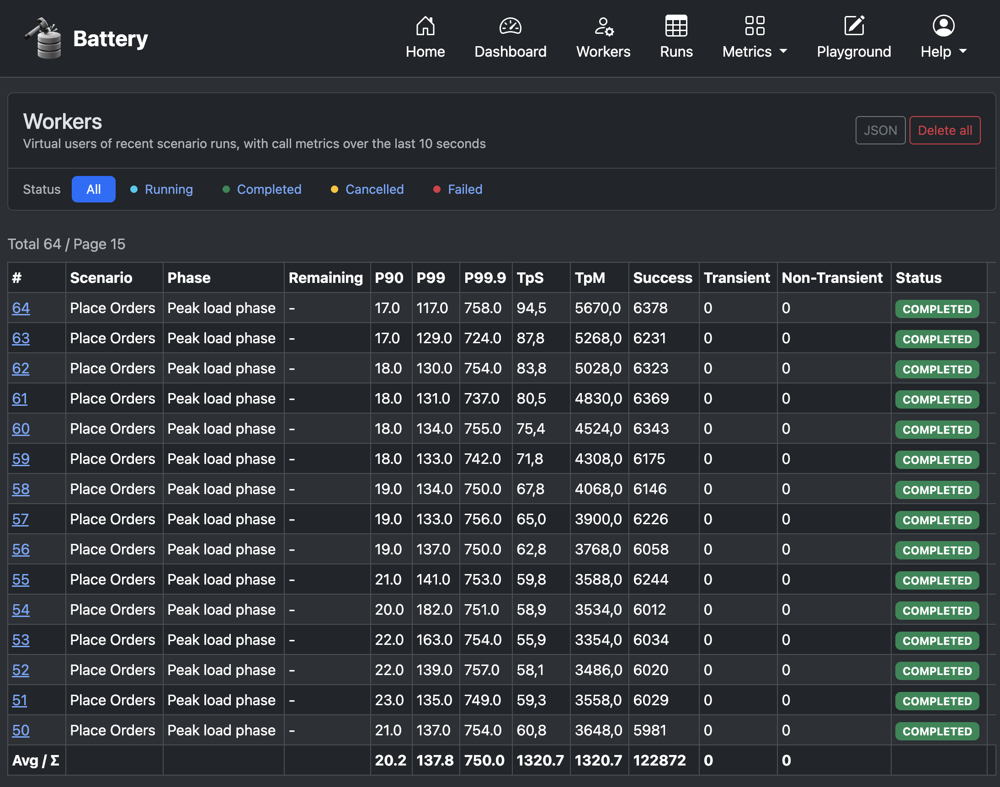
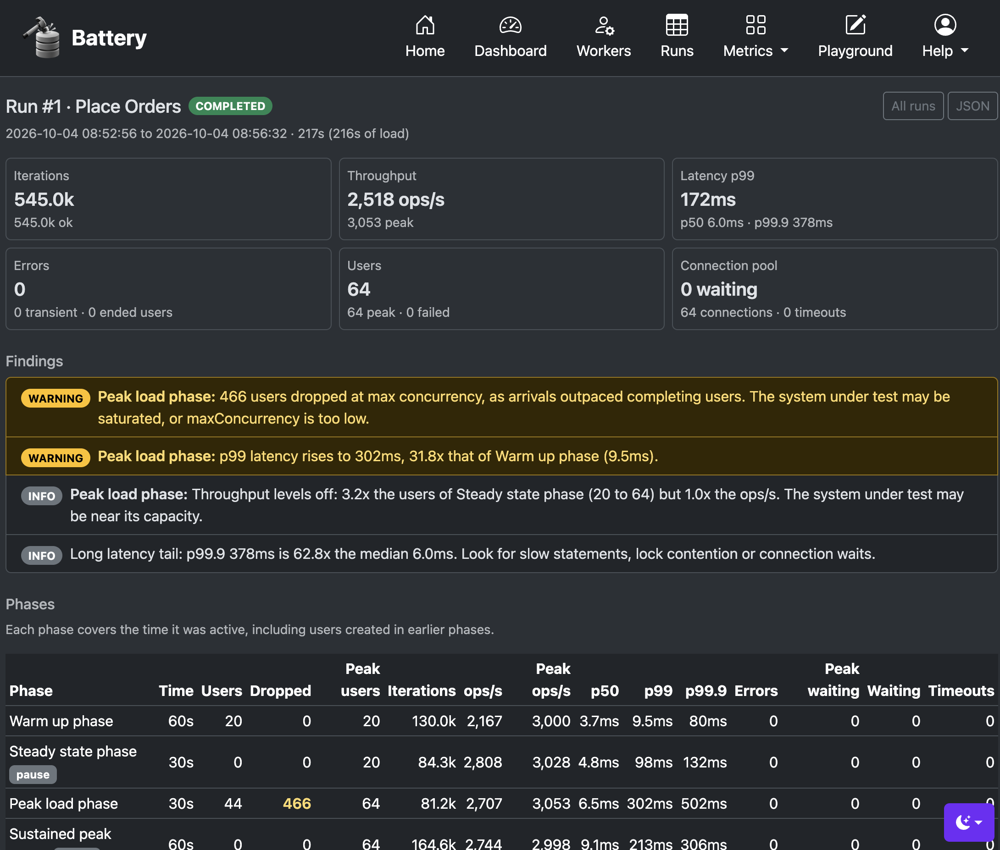
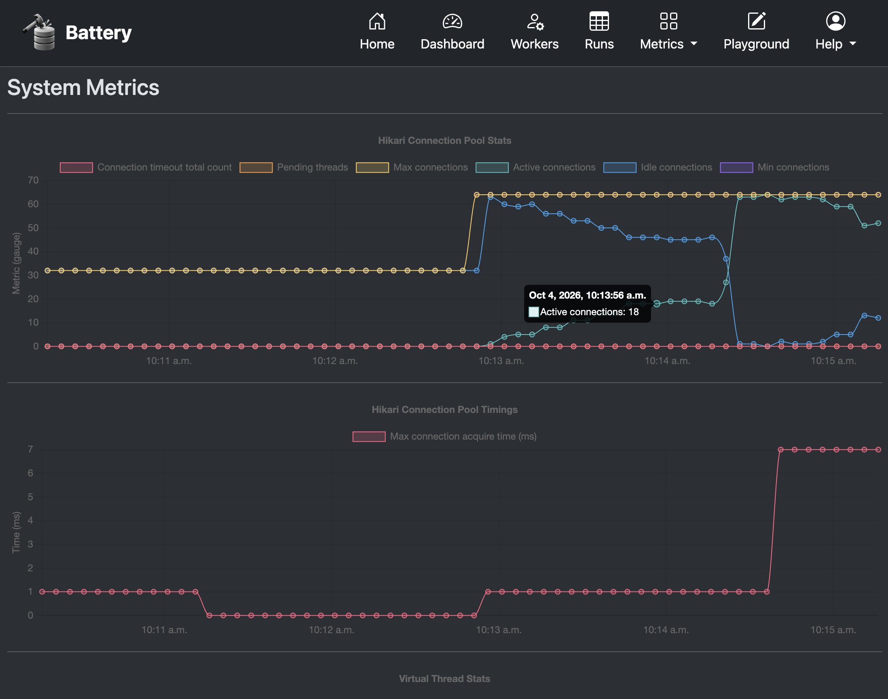

[](https://github.com/kai-niemi/battery/actions/workflows/maven.yml)
[](https://github.com/kai-niemi/battery/actions/workflows/maven.yml)
[](https://github.com/kai-niemi/battery/actions/workflows/maven.yml)

<!-- TOC -->
* [About](#about)
* [Features](#features)
  * [How it works](#how-it-works)
  * [How it looks](#how-it-looks)
* [Quick Start](#quick-start)
* [Usage](#usage)
  * [Compatibility](#compatibility)
  * [Building](#building)
    * [Prerequisites](#prerequisites)
    * [Install the JDK](#install-the-jdk)
    * [Clone the project](#clone-the-project)
    * [Build the artifact](#build-the-artifact)
    * [Build with all JDBC drivers](#build-with-all-jdbc-drivers)
  * [Running](#running)
    * [Command line options](#command-line-options)
    * [Run with an interactive shell](#run-with-an-interactive-shell)
    * [Start in the background](#start-in-the-background)
    * [Stop background server](#stop-background-server)
    * [Endpoints](#endpoints)
  * [Shell Commands](#shell-commands)
    * [Admin](#admin)
    * [Configuration](#configuration)
    * [Logging](#logging)
    * [Scripting](#scripting)
    * [Scenario](#scenario)
    * [Agent](#agent)
* [Tutorial](#tutorial)
  * [Test Configuration](#test-configuration)
  * [SQL Scripts](#sql-scripts)
  * [State Capture](#state-capture)
  * [Battery Scripts](#battery-scripts)
* [Configuration Reference](#configuration-reference)
  * [Connecting to a Database](#connecting-to-a-database)
    * [Connection Pool](#connection-pool)
  * [Before Steps](#before-steps)
  * [After Steps](#after-steps)
  * [Ramping Phases](#ramping-phases)
  * [Scenarios](#scenarios)
  * [Steps](#steps)
  * [Distributed Agents](#distributed-agents)
* [Terms of Use](#terms-of-use)
<!-- TOC -->

# About

 

Battery is an easy-to-use, flexible SQL database load-testing tool for simulating realistic OLTP workloads. It executes
highly concurrent SQL transactions using virtual threads and thousands of virtual users (VUs), while a built-in DSL
enables dynamic scripting of complex, application-like workflows.

# Features

Battery focuses on simplicity and ease of use without compromising the capabilities needed for effective SQL database
load testing.

- Embedded SQL statement templates with state capture and reuse across statements, enabling realistic transactional
  workflows.
- Custom DSL for dynamic, scripted test logic.
- Distributed load generation across multiple agents with configuration consistency checks.
- High-concurrency execution using virtual threads, enabling thousands of VUs with a small resource footprint.
- Interactive command shell for controlling and managing load tests.
- Built-in web UI for observability and test monitoring.
- Hypermedia-driven REST API for automation and integration.
- Prometheus metrics for external monitoring and observability.
- Single executable JAR for simple deployment and operation.

## How it works

A load test is defined in YAML and consists of preparation and cleanup steps, ramp phases, and one or more scenarios.
Each scenario defines the sequence of operations executed by its VUs.

During execution, the load test progresses through a series of phases that control the rate at which VUs are created and
how load changes over time.

Each **step** either executes a single- or multi-statement SQL transaction, or invokes a custom DSL script for dynamic
behavior such as branching, control flow, and state-dependent logic.

Ultimately, a workload is expressed as a sequence or pattern of SQL transactions executed concurrently by VUs.
Load generation can run locally or be distributed across multiple agents, coordinated through a single control agent.

## How it looks

<p align="center">
  
</p>

<table>
  <tr>
    <td></td>
    <td></td>
    <td></td>
  </tr>
</table>

# Quick Start

Assuming a [JDK 21+](#install-the-jdk) and a local PostgreSQL or CockroachDB instance:

**1.** Create the database that the bundled test configurations point at:

PostgreSQL:

    createdb battery                                  

CockroachDB:

    cockroach sql --insecure -e "create database battery"

The default connection URL is `jdbc:postgresql://localhost:5432/battery` with the user 
`root` and no password. To use something else, see [connecting to a database](#connecting-to-a-database).

**2.** Build and start with an interactive shell:

    ./mvnw clean install
    ./run.sh

Pick the `demo-crud` profile from the menu. It only needs standard PostgreSQL 13+ syntax, so it works
on both PostgreSQL and CockroachDB.

**3.** In the shell, validate the model, verify the database connection, then start the load test:

    battery:$ validate model
    battery:$ show db
    battery:$ run

**4.** Watch it live at http://localhost:9090 and stop it early with `cancel`.

Use `help` to list all [shell commands](#shell-commands) and `functions` to list all 
[Battery Script](SCRIPT.md) functions.

# Usage

## Compatibility

Battery supports most modern SQL databases for which there's a JDBC driver.
It bundles JDBC drivers for:

| Database    | Driver  | Bundled                                                   |
|-------------|---------|-----------------------------------------------------------|
| PostgreSQL  | pgJDBC  | Yes, by default                                           |
| CockroachDB | pgJDBC  | Yes, by default                                           |
| MySQL       | MySQL   | Only with the [`jdbc-drivers`](#build-with-all-jdbc-drivers) build profile |
| Oracle      | ojdbc17 | Only with the [`jdbc-drivers`](#build-with-all-jdbc-drivers) build profile |

The bundled test configurations in `config/` target PostgreSQL and CockroachDB. 
For MySQL or Oracle you also need to override the driver class name, see 
[connecting to a database](#connecting-to-a-database).

## Building

Instructions for building the single executable application artifact.

### Prerequisites

- macOS / Linux / Windows (MinGW)
- [Java 21+ JDK](https://openjdk.org/projects/jdk/21/)
- [Git](https://git-scm.com/downloads)

### Install the JDK

macOS (using sdkman):

    curl -s "https://get.sdkman.io" | bash
    sdk list java
    sdk install java 21.0 (use TAB to pick edition)  

Ubuntu:

    sudo apt-get install openjdk-21-jdk

### Clone the project

    git clone git@github.com:kai-niemi/battery.git && cd battery

### Build the artifact

    chmod +x mvnw
    ./mvnw clean install

The server component (executable jar) is now available at `target/battery.jar`.

The unit test coverage report is written to `target/site/jacoco/index.html`.

### Build with all JDBC drivers

The `jdbc-drivers` profile also adds the Oracle and MySQL JDBC drivers to the artifact.

    ./mvnw --activate-profiles jdbc-drivers clean install

## Running

Running battery requires specifying at least one Spring profile name that denotes which 
load test configuration to use. See the [configuration reference](#configuration-reference) 
for more information.

If no profile is given, battery prints the available profiles found in `config/` and exits.

### Command line options

    java -jar battery.jar [options] <profile> [args...]

| Option                    | Description                                                 |
|---------------------------|-------------------------------------------------------------|
| `--help`                  | Print usage and exit                                        |
| `--profiles [profile,..]` | Comma-separated list of spring profiles to activate         |
| `--noshell`               | Disable the interactive shell (headless mode)               |
| `--offline`               | Don't start the embedded Jetty container (shell only)       |
| `@<file>`                 | Read shell commands from a file, implies non-interactive    |

Any other `--option` is passed through to Spring Boot, so any property in 
[application.yml](src/main/resources/application.yml) can be overridden on the command 
line, for example `--spring.datasource.url=jdbc:postgresql://localhost:5432/other`.

The helper scripts below expect to be run from the project root (or from an unpacked 
distribution), since the test configurations are resolved relative to `config/`.

### Run with an interactive shell

This helper script provides a start menu for the _interactive shell_ run mode.

    ./run.sh

It also accepts the command line options directly, bypassing the menu:

    ./run.sh --profiles bank

### Start in the background

This helper script provides a start menu for the _non-interactive_ headless run mode.

    ./start.sh

To run shell commands in headless mode, first add the commands to a plain text file.

For example:

    echo "version" > cmd.txt
    echo "run" >> cmd.txt

Then start the server in the background by passing a command file name as an argument 
with a `@` prefix:

    ./start.sh --profiles bank @cmd.txt

Standard output is redirected to `.log/battery-stdout.log`.

### Stop background server

This command stops the server, if it's running:

    ./stop.sh

### Endpoints

In all run modes above, these are the default endpoint addresses and listen ports:

| Endpoint   | URL                                           |
|------------|-----------------------------------------------|
| Frontend   | http://localhost:9090                         |
| Runs       | http://localhost:9090/run                     |
| Playground | http://localhost:9090/playground              |
| API Root   | http://localhost:9090/api                     |
| Actuators  | http://localhost:9090/api/actuator            |
| Prometheus | http://localhost:9090/api/actuator/prometheus |

The listen port is changed with `--server.port=<port>`, which is also needed when 
running several [agents](#distributed-agents) on the same host.

## Shell Commands

The shell is the primary control plane for running and managing load tests. Type `help` for the full command list,
`help <command>` for command-specific options, and use TAB completion for commands, scenario names, and script
functions.

Once a run started with `run` completes, including all of its VUs, the shell displays a detailed **run
summary** containing:

- Run outcome and phase results.
- Aggregate throughput and operation totals.
- Whole-run latency percentiles.
- Virtual user and connection pool statistics.
- Findings such as connection pool saturation, dropped users, throughput leveling off, or latency degradation between
  phases.

Run summaries are also logged, retained in memory for the 20 most recent runs (`show runs`, `show run`), and persisted
as JSON under `.log/runs/`.

The web dashboard displays the most recent run summary when no scenario is active, while the **Runs** page provides
access to recent runs and their full summaries. Run summaries are also available for automation through
the [REST API](API.md#run-summaries-api-apirun) under `/api/run`.

### Admin

| Command                  | Alias            | Description                                             |
|--------------------------|------------------|---------------------------------------------------------|
| `quit`                   | `q`              | Exit the shell and stop the server                      |
| `stacktrace`             | `x`              | Show last exception stacktrace                          |
| `system`                 | `y`              | Show system information                                 |
| `uptime`                 | *(none)*         | Show application uptime                                 |

### Configuration

| Command                  | Alias            | Description                                             |
|--------------------------|------------------|---------------------------------------------------------|
| `show db`                | `sd`             | Show database information                               |
| `show pool config`       | `spc`            | Show connection pool configuration                      |
| `show pool status`       | `sps`            | Show connection pool status                             |
| `show model`             | `sm`             | Show effective model YAML                               |
| `validate model`         | `vm`             | Validate model YAML                                     |

### Logging

| Command                  | Alias            | Description                                             |
|--------------------------|------------------|---------------------------------------------------------|
| `log sql`                | `ls`             | Toggle SQL trace logging                                |
| `log trace\|debug\|info` | `lt`, `ld`, `li` | Set the application log level                           |

### Scripting

| Command                  | Alias            | Description                                             |
|--------------------------|------------------|---------------------------------------------------------|
| `functions`              | `f`              | List all Battery Script functions grouped by namespace  |
| `execute`                | `e`              | Execute a Battery Script expression ad-hoc              |
| `show state`             | `ss`             | Show state captured by `execute --capture`              |
| `wipe state`             | `ws`             | Wipe captured state                                     |

### Scenario

| Command                  | Alias            | Description                                             |
|--------------------------|------------------|---------------------------------------------------------|
| `run`                    | `r`              | Run a named or weighted-random scenario                 |
| `cancel`                 | `c`              | Cancel the active scenario                              |
| `show status`            | `ss`             | Show status of the active scenario                      |
| `show runs`              | `sr`             | List recent scenario runs and their key metrics         |
| `show run`               | `su`             | Show the summary of the last run, or `--id` a given run |
| `show workers`           | `sw`             | List virtual user workers and their metrics             |
| `show errors`            | `se`             | List errors reported by virtual user workers            |
| `clear workers`          | `cw`             | Clear non-running virtual user workers                  |
| `clear errors`           | `ce`             | Clear virtual user worker errors                        |

### Agent

| Command                  | Alias            | Description                                             |
|--------------------------|------------------|---------------------------------------------------------|
| `ping`                   | `p`              | Ping remote agent(s)                                    |
| `agent run`              | `ar`             | Run a scenario across remote agent(s)                   |
| `agent show status`      | `asu`            | Show scenario status of remote agent(s)                 |
| `agent cancel`           | `ac`             | Abort scenario on remote agent(s)                       |
| `agent show workers`     | `asw`            | Show virtual user workers on agent(s)                   |
| `agent show errors`      | `ase`            | Show virtual user worker errors on agent(s)             |
| `agent clear workers`    | `acw`            | Clear all non-running virtual user workers on agent(s)  |

The `run`, `agent run`, `cancel` and `agent cancel` commands are only available when it 
makes sense to invoke them. If `run` is unavailable, a scenario is already running; the 
`agent *` commands and `ping` require at least one configured [agent](#distributed-agents).

# Tutorial

Battery can be operated through its interactive shell, web frontend, or [REST API](API.md). The shell serves as the
primary control plane, while the API supports automation and coordination of distributed load tests.

During a load test, Battery collects execution times, throughput, error rates, and other runtime metrics. These can be
monitored directly through the built-in web UI or exposed through a Prometheus endpoint for integration with external
observability systems.

A load test is defined in a YAML configuration describing its execution phases and one or more scenarios. SQL statements
and Battery Script code can be embedded directly in scenario steps or loaded from external files.

## Test Configuration

A test configuration is specified in a local [`application-XX.yml`](config/demo/application-demo-crud.yml) YAML file, 
where `XX` is some arbitrary profile name. See the `config/` directory to get
a general idea of the concept and layout of different test configurations.

Configuration files are picked up from `config/*/` at startup, so a configuration in
`config/demo/application-demo-crud.yml` is activated with `--profiles demo-crud`.

The `battery` section is bound with unknown fields rejected, which means a misspelled 
attribute fails startup rather than being silently ignored. Use `validate model` to check 
a configuration and `show model` to print the effective, parsed model.

## SQL Scripts

One convenient way to define load tests is through embedded SQL statements or scripts. SQL can be parameterized, and
values produced by one statement can be captured and reused by subsequent statements, enabling stateful transactional
workflows.

Example:

```yaml
battery:
  before:
    steps:
      - name: Prepare Schema
        sql: |-
          create schema if not exists demo;
          
          create table if not exists demo.customer
          (
              id         uuid        not null default gen_random_uuid(),
              email      varchar(64) not null,
              first_name varchar(64),
              last_name  varchar(64),
          
              primary key (id)
          );

  scenarios:
    - name: Customer CRUD
      duration: 2m
      steps:
        - name: Create Customer
          capture: true
          sql: |-
            insert into demo.customer (id, email, first_name, last_name) 
            values (gen_random_uuid(), 
                    '#{ gen.randomEmail() }',
                    '#{ gen.randomFirstName() }', 
                    '#{ gen.randomLastName() }' )
            returning id;

        - name: Retrieve Customer
          sql: |-
            select * from demo.customer where id = :id;
          params:
            id: id
```

In the example above, the `#{ ... }` expands dynamic Battery Script expressions directly within the SQL string, 
while `params:` provides named parameter bindings where the values are evaluated by the Battery Script engine 
(e.g. `first_name: gen.randomFirstName()`).

Notice that `params` is a map of `name: expression` entries, where `name` matches a `:name` 
placeholder in the SQL and the expression is evaluated for every execution.

## State Capture

A step marked with `capture: true` passes its result on to the following steps in the same 
scenario iteration, which is how the `Retrieve Customer` step above resolves `:id`. The 
shape of the captured state depends on the number of rows returned:

- **A single row** is flattened, so each **column name becomes a variable**. A step returning
  `id` is therefore referenced as `id` in a later step.
- **Multiple rows** are bound as a list of row maps under the variable `result`, which is
  accessed by index and column name, for example `result.get(0).get("id")`.

The variable name for the multi-row case is changed per step with `resultName`:

````yaml
- name: Find Customers
  capture: true
  resultName: customers
  sql: select id, email from demo.customer order by random() limit 100;

- name: Pick One
  sql: select * from demo.customer where id = :id;
  params:
    id: std.selectRandom(customers).get("id");
````

A step without `capture` still reads the accumulated state — that's how `Retrieve Customer`, 
`Update Customer` and `Delete Customer` all resolve `:id` from the single capturing step — 
it just doesn't contribute its own result to it.

Captured state is scoped to a single VU and carried between the steps of one 
iteration, starting over on the next one. State captured by the [before steps](#before-steps) 
is passed as the initial state to every VU.

## Battery Scripts

Battery Script is a purpose-built DSL supporting variables, expressions, control-flow constructs, 
asynchronous fork/join operations, and a function library for SQL execution and random data generation.

It provides a lightweight way to model application-like workload behavior that would be difficult to 
express with SQL templates alone, without requiring a general-purpose programming language.

See the [Battery Script](SCRIPT.md) tutorial for a language introduction, and use the
`functions` shell command to list the function library of the running version.

Functions are always namespace qualified. The namespaces are `std` (general purpose), 
`gen` (random data generation), `jdbc` (SQL execution), `log`, `encoding`, `network` 
and `wgs`.

Example script:

```java
// Loop 10 times and insert one row per cycle
for y from 1 to 10 {
   jdbc.update("insert into account (id,city,balance) values(unordered_unique_rowid(),?,?)",
                L[gen.randomWord(10 + y), gen.randomDouble(10.00,100.00)]);
}
```

Another example shows a decomposed `UPSERT` with branching logic:

```java
ids = jdbc.queryForList("select id,balance from account order by random() limit 100");
// Pick random id and pass as parameter
id = std.selectRandom(ids).get("id");
a = jdbc.queryForMap("select * from account where id=?", L[id]);
// Either insert or update 
if (a.isEmpty()) {
    jdbc.update("insert into account (id,city,balance) values(unordered_unique_rowid(),?,?)",
                L[gen.randomWord(12),gen.randomDouble(10.00,100.00)]);
} else {
    jdbc.update("update account set balance=balance+?::decimal where id=?",
                L[gen.randomDouble(1.00,100.00), id]);
}
```

Another example of a Battery script embedded in the YAML:

```yaml
battery:
  scenarios:
    - name: Browse
      duration: 2m
      steps:
        - name: Keyset Pagination
          script: |-
            rows = 0;
            pages = 0;
            _list = jdbc.queryForList("select * from demo.customer order by id limit 100");
            while (!_list.isEmpty()) {
                pages = pages + 1;
                _lastId = null;
                foreach (_list) {
                    rows = rows + 1;
                    _lastId = _x.get("id");
                }
                _list = jdbc.queryForList("select * from demo.customer where id > ? order by id limit 100", L[_lastId]);
            }
```

In the Battery Script examples above, `L[...]` creates a List, `S[...]` creates a Set, `M[...]` creates a Map, 
and `[...]` creates an Array. You can find more syntax specifics in the 
[Parser Grammar](src/main/java/io/battery/script/BatteryParser.g4).

# Configuration Reference

This section takes a closer look at how to craft a load test.

A YAML configuration must contain a `battery` section that defines the structure and execution of the test, including
**before steps**, **after steps**, **ramp phases**, and **scenarios** composed of individual **steps**.

```yaml
battery:
  baseDir: config/XX
  before:
    ..
  after:
    ..
  phases:
    ..
  scenarios:
    ..
  network:
    ..
```

| Attribute   | Description                                                                          |
|-------------|--------------------------------------------------------------------------------------|
| `baseDir`   | Directory that step `path` attributes are resolved against, relative to the CWD       |
| `before`    | Optional [preparation steps](#before-steps) executed once before ramping up           |
| `after`     | Optional [cleanup steps](#after-steps) executed once after ramping up                 |
| `phases`    | The [VU ramping phases](#ramping-phases) (required, at least one)                     |
| `scenarios` | The [scenarios](#scenarios) to run (required for anything to happen)                  |
| `network`   | Optional remote [agents](#distributed-agents) for distributed load generation         |

Unknown attributes under `battery` are rejected at startup, so a typo surfaces as a 
binding error rather than being ignored.

## Connecting to a Database

In addition, you can override any baseline setting in [application.yml](src/main/resources/application.yml).
For example, the datasource settings:

```yaml
# override datasource and concurrency settings
spring:
  datasource:
    url: jdbc:postgresql://bigone.aws-eu-north-1.cloud:5432/battery
    username: root
    password: ..

battery:
  ...
```

The defaults are `jdbc:postgresql://localhost:5432/battery` with the user `root` and no 
password, using the pgJDBC driver. For MySQL or Oracle, build with the 
[`jdbc-drivers`](#build-with-all-jdbc-drivers) profile and also set the driver class name:

```yaml
spring:
  datasource:
    driver-class-name: com.mysql.cj.jdbc.Driver
    url: jdbc:mysql://localhost:3306/battery
    username: root
    password: ..
```

### Connection Pool

The connection pool is configured under `spring.datasource.hikari` and defaults to a fixed size of 32 connections,
ensuring the pool is warm before VUs begin ramping.

A VU acquires a connection for each SQL statement, or holds one for the entire iteration when running a transactional
scenario. Outside database operations, the VU continues executing without an artificial pause.

Database concurrency is therefore bounded by the smaller of the number of active VUs and the available connection pool
size. When the number of VUs exceeds the pool size, excess VUs queue for a connection. This wait time is included in the
measured latency and is visible in the connection pool chart through the number of pending threads and the maximum
connection wait time.

To accommodate the configured workload, a run can grow the connection pool to the highest `maxConcurrency` across its
phases, or `users` for phases using a fixed number of users. The expanded pool remains available until all VUs for the
run have completed.

Pool growth is capped by `battery.connectionPool.maxSize`. This value should remain within the database connection limit
while leaving sufficient capacity for other clients. For example, PostgreSQL defaults to a maximum of 100 connections:

```yaml
battery:
  connectionPool:
    autoSize: true # grow the pool for each run (default true)
    maxSize: 64    # largest pool size for a run, or 0 to keep the configured size (default 64)
```

On startup, a warning is logged for each phase that can run more concurrent VUs than the pool
can provide. When no connection becomes available within `spring.datasource.hikari.connection-timeout` 
(5s), the VU counts a transient error and retries (with backoff, see the scenario settings) rather than
failing. Use `show pool status` to see whether VUs are queueing for connections.

## Before Steps

Before steps are optional preparation steps executed once before VUs begin ramping. A before step 
either executes a SQL script or a Battery Script, which in turn can execute a sequence of SQL statements.

````yaml
battery:  
  before:
    steps:
      - name: Prepare Schema
        sql: |-
          create schema if not exists demo;
      
      - name: Create Tables
        sql: |-
          create table if not exists demo.customer
          (
              id         uuid        not null default gen_random_uuid(),
              email      varchar(64) not null,
              first_name varchar(64),
              last_name  varchar(64),

              primary key (id)
          );
````

Any state [captured](#state-capture) by a before step is passed as the initial state to 
every VU, which is how lookup data is shared across a test run.

## After Steps

After steps are optional cleanup steps executed at most once. Notice that after steps 
are invoked potentially before all workers have completed unless `awaitCompletion` is `true` 
(default is `false`).

````yaml
battery:  
  after:
    awaitCompletion: true
    steps:
      - name: Drop Schema
        sql: |-
          drop schema if exists demo cascade;
````

## Ramping Phases

The `phases` section defines at which rate VUs are created or _ramped up_. A single VU
runs through the steps of a given scenario. Ramping typically follows a linear progression curve to simulate
phases, such as a warmup phase, a sustained steady state phase and a final stress phase.

Phase attributes include:

- `name`: Descriptive name of the phase (required).
- `duration`: Time duration for the phase, specified in duration format such as `60s` or `2m` (required).
- `users`: Total number of VUs created evenly over the phase duration (optional, default `0`). For example, `users: 20` with `duration: 60s` creates one VU every 3 seconds.
- `startRate`: Initial creation rate in VUs per second (optional, default `0`).
- `maxRate`: Final creation rate in VUs per second, reached at the end of the phase duration (optional, defaults to `startRate`). The rate increases linearly from `startRate` to `maxRate`, so the phase creates `(startRate + maxRate) / 2 * duration` VUs in total. If only `startRate` is set, the rate is constant. If only `maxRate` is set, the rate ramps up from zero.
- `maxConcurrency`: Maximum number of concurrently active VUs allowed while the phase creates new VUs (optional, default `0` for unlimited). Virtual users still running from earlier phases count towards the limit. When the limit is reached, newly arriving VUs are dropped rather than queued, so the phase keeps its arrival rate and duration. The number of dropped VUs per phase is logged as a warning, which indicates that the system under test isn't keeping up with the arrival rate.

A phase either sets `users` or the `startRate`/`maxRate` rates, not both. When both rates are set, `startRate` 
must be less than or equal to `maxRate`. If none are set, the phase acts as a pause/sustained phase.

The example below defines 4 phases: warmup, ramp, steady and sustained. The warmup phase creates a total 
of 20 VUs over 60 seconds. The ramp phase increases the creation rate from 2 to 30 VUs 
per second over 60 seconds (960 VUs in total), and the steady phase holds a constant rate of 
10 VUs per second for 90 seconds. The final sustained phase introduces no new VUs for 60 seconds, 
allowing already-running VUs to continue before the test ends.

Notice that VUs can run past the duration of a ramping phase. A phase also does not wait 
for all VUs to complete before proceeding to the next phase, thus there can be overlap.

````yaml
battery:
  phases:
    - name: warmup
      duration: 60s
      users: 20
    - name: ramp
      duration: 60s
      startRate: 2
      maxRate: 30
    - name: steady
      duration: 90s
      startRate: 10
    - name: sustained
      duration: 60s
````

## Scenarios

Scenarios group the SQL operations, represented by SQL or Battery scripts, that make up a workload. Each scenario
contains one or more **steps** that are executed sequentially by each virtual user (VU), while multiple VUs execute the
scenario concurrently. The ramp phases control how VUs are introduced over time and can optionally cap the number 
of concurrently active VUs.

A scenario step executes either a SQL script or a Battery script. Scripts can in turn execute sequences of SQL
statements using implicit or explicit transactions. Variables produced by **before steps** can be passed into scenario
scripts, allowing setup state to be reused during the workload.

When multiple scenarios are defined, scenarios can be selected randomly according to configured weights, allowing
different workload patterns to be mixed in controlled proportions.

Scenario attributes:

| Attribute                   | Default  | Description                                                                                  |
|-----------------------------|----------|-----------------------------------------------------------------------------------------------|
| `name`                      | –        | Descriptive name of the scenario (required)                                                    |
| `alias`                     | `name`   | Short name accepted by `run --name <alias>`                                                    |
| `duration`                  | –        | How long each virtual user repeats the steps, such as `2m` (required)                          |
| `steps`                     | –        | The [steps](#steps) executed in sequence per iteration (required, at least one)                |
| `weight`                    | `1.0`    | Relative probability of being picked when `run` is invoked without a name                      |
| `transactional`             | `false`  | Wrap all steps of an iteration in one explicit transaction, rather than one per statement      |
| `continueOnTransientErrors` | `true`   | Keep the virtual user going on retryable errors, such as serialization conflicts or connection pool timeouts |
| `backoffOnTransientErrors`  | `true`   | Apply an exponential backoff delay with jitter before retrying after a transient error         |
| `primary`                   | `false`  | Mark as the scenario preselected in the web frontend, defaults to the first one                |

In the following scenario there are 4 steps to simulating a CRUD sequence for one table:

````yaml
battery:
  phases: ..
  before: ..
  scenarios:
    - name: Customer CRUD
      alias: cc
      duration: 2m
      steps:
        - name: Create Customer
          capture: true
          sql: |-
            insert into demo.customer (id, email, first_name, last_name) 
            values (gen_random_uuid(), 
                    '#{ gen.randomEmail() }',
                    '#{ gen.randomFirstName() }', 
                    '#{ gen.randomLastName() }' )
            returning id;

        - name: Retrieve Customer
          sql: |-
            select * from demo.customer where id = :id;
          params:
            id: id

        - name: Update Customer
          sql: |-
            update demo.customer 
            set first_name=:first_name, last_name=:last_name
            where id=:id;
          params:
            id: id
            first_name: gen.randomFirstName()
            last_name: gen.randomLastName()

        - name: Delete Customer
          sql: |-
            delete from demo.customer 
            where id=:id;
          params:
            id: id
````

That scenario is started by name or by alias:

    battery:$ run --name cc

## Steps

A step is the unit of work in the before, after, and scenario sections. Exactly one of 
`sql`, `script` or `path` must be set.

| Attribute       | Default  | Description                                                                              |
|-----------------|----------|-------------------------------------------------------------------------------------------|
| `name`          | –        | Descriptive name of the step, also used as the metrics label (required)                    |
| `sql`           | –        | Embedded SQL, one or more `;` separated statements                                         |
| `script`        | –        | Embedded [Battery Script](SCRIPT.md)                                                       |
| `path`          | –        | External script file resolved against `baseDir`                                            |
| `params`        | `{}`     | Map of `name: expression` bindings for `:name` placeholders in the SQL                     |
| `capture`       | `false`  | Pass the result of this step to the following steps, see [state capture](#state-capture)   |
| `resultName`    | `result` | Variable name that a multi-row result is bound to                                          |
| `maxIterations` | `0`      | Only run the step for the first N iterations of a virtual user, `0` for every iteration    |
| `skip`          | `false`  | Disable the step without removing it from the configuration                                |

The `path` attribute keeps larger scripts out of the YAML. The file format is resolved from 
the suffix: `.sql` for SQL and `.b` for Battery Script.

````yaml
battery:
  baseDir: config/bank
  before:
    steps:
      - name: Create Schema
        path: create-crdb.sql
````

The `maxIterations` attribute is useful for per-VU seeding, where the first iteration 
populates data that the remaining iterations then read:

````yaml
- name: Find Customers
  capture: true
  maxIterations: 1
  resultName: customers
  sql: select id, email from retail.customer order by random() limit 100;
````

## Distributed Agents

Load can be generated from several battery instances driven from one control plane. Each 
agent is an ordinary battery server; the instance you drive from simply lists the others 
under `network.agents`:

````yaml
battery:
  network:
    agents:
      - name: host-1
        url: "http://localhost:9090"
      - name: host-2
        url: "http://localhost:9091"
      - name: host-3
        url: "http://localhost:9092"
````

**All agents must run the exact same test configuration.** A distributed start sends a hash 
of the model along with the request and an agent rejects a scenario if its own model hashes 
differently. This rules out a run where agents silently execute different workloads. The 
`agent ping` command prints the local hash along with the build info of each agent.

Agents are started like any other instance, for example on one host:

    ./start.sh --profiles bank --server.port=9091

Then, from the controlling instance:

    battery:$ agent ping
    battery:$ agent run --name cc
    battery:$ agent show status
    battery:$ agent cancel 

The `agent ...` commands are only available when at least one agent is configured. 
Agents are driven over the same [REST API](API.md) used for 
automation, so the same coordination is scriptable outside the shell.

# Terms of Use

See [MIT](LICENSE.txt) for terms and conditions.

---
